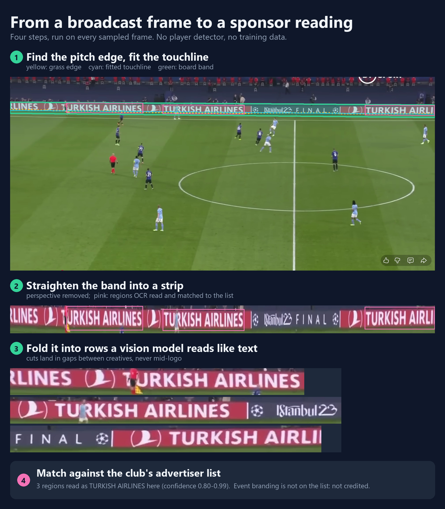
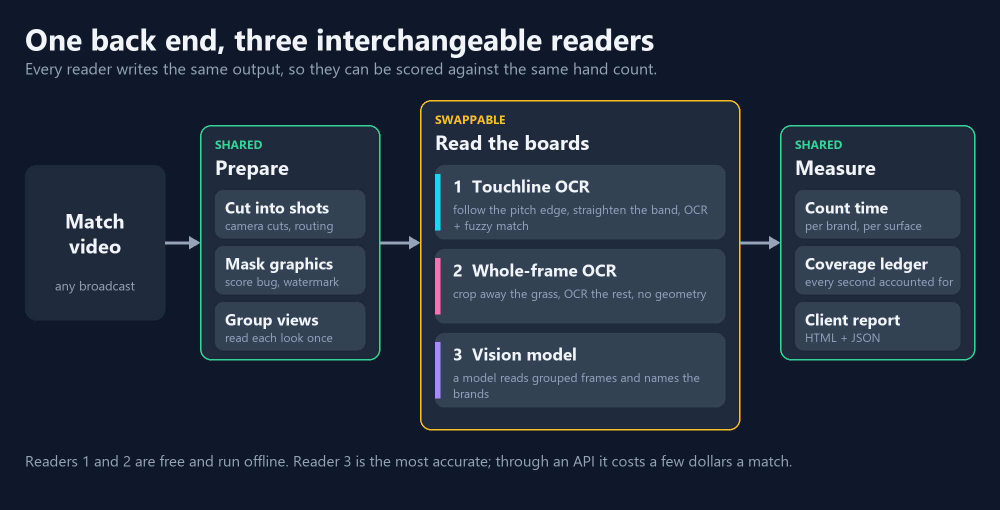
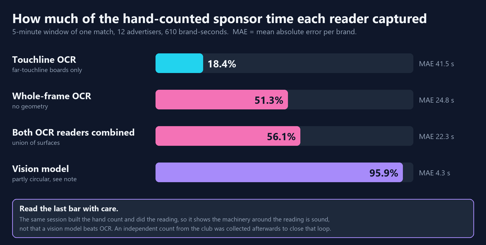
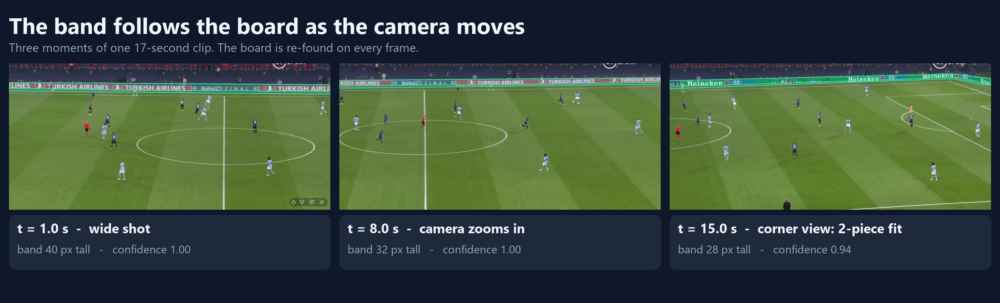

# Sponsor-exposure analytics for football broadcasts

Given a match video, report **how much on-screen exposure each sponsor got**:
seconds on screen, share of the broadcast, and (where measurable) size. The
aim is an independent, auditable measurement that European clubs can hand to
their commercial partners.

Developed in collaboration with a professional second-tier football club,
whose broadcast and advertiser list were used to build and validate it.



*One sampled frame through the board path. Frames are from a match broadcast clip and are shown to illustrate the method.*

## How it works



Every match goes through the same shared stages. Only the middle step, reading
the boards, is swappable, and every reader writes the same output, so any two
can be scored against the same hand count.

- **Prepare:** cut the match into shots, blank the broadcaster's own graphics
  (score bug, watermark), group views that look alike so each is read once.
- **Measure:** count time per brand and per surface, keep a coverage ledger
  that accounts for every second, and render a client report.

### Three ways to read the boards

| Reader | What it does | Speed | Cost | Where it fails |
|---|---|---|---|---|
| **Touchline OCR** | Follows the pitch edge, straightens the board band, OCRs it and fuzzy-matches against the sponsor list | Slow, OCR-bound | Free, offline | Needs a board along a fittable far touchline: a usable band on 41% of the test clip. Stylised or low-contrast logos read short |
| **Whole-frame OCR** | Crops away the grass and OCRs the rest, no geometry | About 2.5 h per 90-minute match after the grass crop (about 15 h before it) | Free, offline | Same legibility bias on stylised marks |
| **Vision model** | A model reads grouped frames and names the brands | Minutes per match through an API | About $8 a match (estimate from a dry run), or free if a person reads exported frames | Needs an API key and sends crops to a third party. The benchmark is partly circular, see below |

## Results



Measured on a hand-counted 5-minute window of a real match. The vision result
is **partly circular**: the same session built the hand count and did the
reading, so it shows the machinery around the reading is sound, not that a
vision model beats OCR in general. An independent count from the club was
collected afterwards to close that loop.

What the OCR rows reveal is a **legibility bias**: time is credited in
proportion to how readable a wordmark is, not whether the brand is present.
Plain horizontal wordmarks land, stylised marks fail, and aliasing cannot fix
that without overfitting to one clip. That is the argument for the vision
reader.

## Design ideas worth a look



- **Board finder (`brand_reader/board_regions.py`).** Zero-shot object
  detection failed on perimeter boards, so the finder follows the pitch
  boundary, fits it with a robust piecewise-linear line (one knot, accepted
  only when a tail of the boundary sits systematically off the straight fit,
  so a corner shot keeps both touchline and goal-line boards) and un-warps the
  band. The fit maths is locked by `board_regions_selftest.py`.
- **Burned-in graphics are measured, not hardcoded (`overlay_mask.py`).** A
  watermark is the only thing that stays pixel-identical while the camera cuts
  between scenes, so it is found from the video's own statistics. It refuses to
  run rather than guess when the evidence is thin.
- **The coverage ledger and honest scoring.** The original failure was not a
  wrong number, it was that nothing knew those seconds existed, so spans must
  tile the whole match. `score.py` separates "a sponsor credited zero seconds"
  (loses the contract) from "a sponsor with the wrong number" (accuracy).

## Limits

Cut-detection thresholds, the `band_confidence` constants and the grass hue
range were tuned on the footage I had and need re-measuring on another
broadcaster. The overlay mask, the matcher's containment rule and the
union-of-surfaces arithmetic are not tuned to a clip.

## Run it

The selftests use synthetic data and need no footage:

```
python board_regions_selftest.py
python overlay_mask_selftest.py
python aggregate_selftest.py
python pitch_crop_selftest.py
python merge_surfaces_selftest.py
```

A full run takes a video in and writes a scored per-advertiser table out:

```
python run_clip.py --video input_videos/match.mp4 --run-name demo
```

```
brand_reader/   board finder, overlay mask, shot typing, tracking, OCR matching
pipeline/       one module per stage
run_clip.py     video in, per-advertiser table out
score.py        compare a run against a hand count
docs/           the figures above
```

Broadcast footage, the club's advertiser list and the hand count are not
included in this repository.
